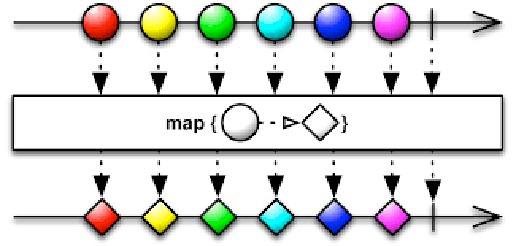
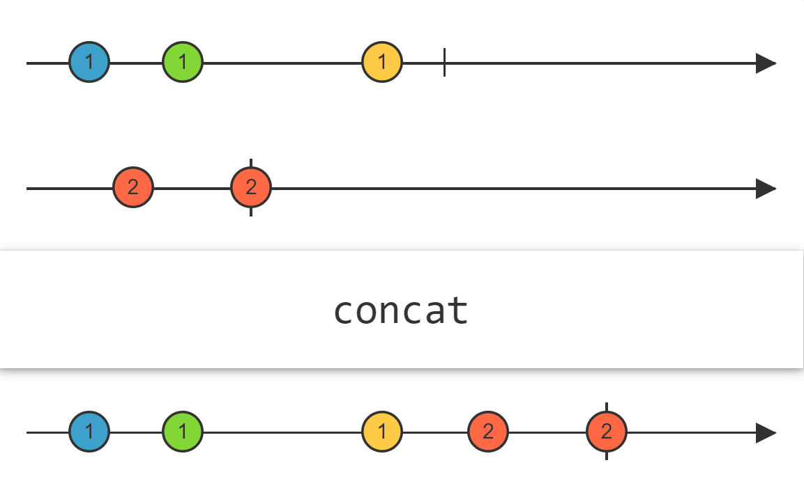
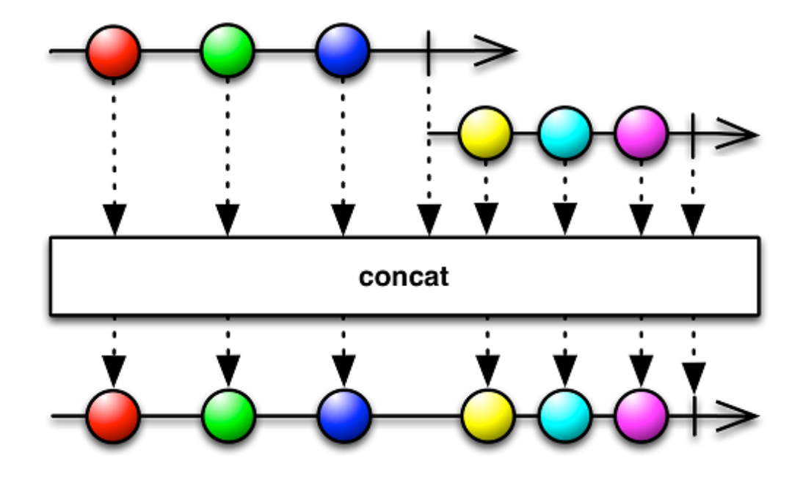
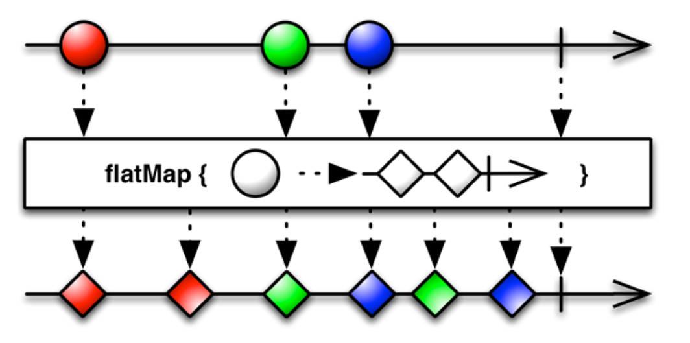
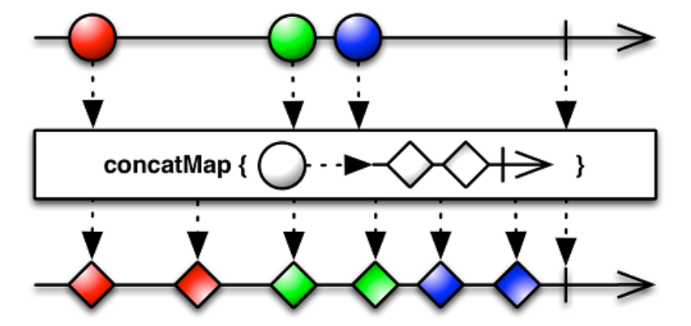
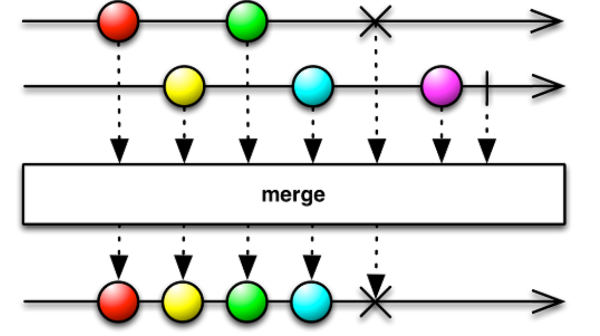
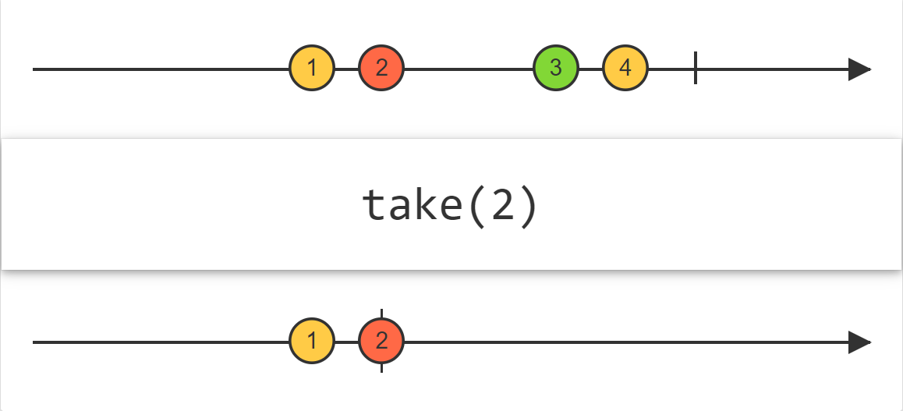

Example
cd RxCXXProgram/CPP-Reactive-Programming/Chapter07/Source_Code
g++ -o First -I./RxCpp-master/Rx/v2/src/rxcpp First.cpp
./First
```sh
OnNext: 1
OnNext: 2
OnNext: 3
OnNext: 4
OnNext: 5
OnNext: 6
OnNext: 7
OnNext: 8
OnNext: 9
OnNext: 10
OnNext: 11
OnNext: 12
OnCompleted
```

g++ -o Second -I./RxCpp-master/Rx/v2/src/rxcpp Second.cpp
```sh
OnNext: 4
OnNext: 16
OnNext: 36
OnNext: 64
OnNext: 100
OnNext: 144
OnCompleted
```

g++ -o STLContainerStream -I./RxCpp-master/Rx/v2/src/rxcpp STLContainerStream.cpp
```sh
OnNext: 1
OnNext: 2
OnNext: 3
OnCompleted
```

g++ -o ObserverFromScratch -I./RxCpp-master/Rx/v2/src/rxcpp ObserverFromScratch.cpp
```sh
OnNext: 1
OnNext: 4
OnNext: 9
OnCompleted
```



g++ -o map -I./RxCpp-master/Rx/v2/src/rxcpp map.cpp
```sh
OnNext: 1
OnNext: 4
OnNext: 9
OnNext: 16
OnNext: 25
OnNext: 36
OnNext: 49
OnNext: 64
OnNext: 81
OnNext: 100
OnCompleted
```

g++ -o map_with_pipe -I./RxCpp-master/Rx/v2/src/rxcpp map_with_pipe.cpp
```sh
OnNext: 1
OnNext: 4
OnNext: 9
OnNext: 16
OnNext: 25
OnNext: 36
OnNext: 49
OnNext: 64
OnNext: 81
OnNext: 100
OnCompleted
```

g++ -o Concat -I./RxCpp-master/Rx/v2/src/rxcpp Concat.cpp
```sh
OnNext: 1
OnNext: 2
OnNext: 3
OnNext: 4
OnNext: 5
OnNext: 6
OnCompleted
```


g++ -o Concatatenate -I./RxCpp-master/Rx/v2/src/rxcpp Concatatenate.cpp
```sh
OnNext: 2
OnNext: 4
OnNext: 6
OnNext: 1
OnNext: 4
OnNext: 9
OnCompleted
```


g++ -o FlatMap -I./RxCpp-master/Rx/v2/src/rxcpp FlatMap.cpp
```sh
Mr. Praseed
Monsieur Praseed
Mr. Peter
Sri Praseed
Monsieur Peter
Mr. Sanjay
Sri Peter
Monsieur Sanjay
Mr. Raju
Sri Sanjay
Monsieur Raju
Sri Raju
Hello World..OnCompleted
```
Running it several times generate the same results, but not as the sequence we'd expect.
It is the same even when recompile and rerun.
And always the same as the textbook.


g++ -o ConcatMap -I./RxCpp-master/Rx/v2/src/rxcpp ConcatMap.cpp
```sh
Mr. Praseed
Monsieur Praseed
Sri Praseed
Mr. Peter
Monsieur Peter
Sri Peter
Mr. Sanjay
Monsieur Sanjay
Sri Sanjay
Mr. Raju
Monsieur Raju
Sri Raju
Hello World..OnCompleted
```


g++ -o MergeNew -I./RxCpp-master/Rx/v2/src/rxcpp MergeNew.cpp
```sh
OnNext: 4
OnNext: 5
OnNext: 6
OnNext: 1
OnNext: 2
OnNext: 3
OnCompleted
```
merge要用我改了后的代码才行

Both `flat_map` and `concat_map` more or less do the same operation. The difference lies in the way values are combined together. The `flat_map`  uses the `merge` Operator, while the `concact_map` uses the `concact` Operator for post processing of results. In the case of `merge`, the order does not matter. The `concat` operator appends Observables one after the another. That is why you got synchronized output with `concat_map` and `flat_map` produced irregularly ordered results.


g++ -o Merge -I./RxCpp-master/Rx/v2/src/rxcpp Merge.cpp

g++ -o Unsubscribe -I./RxCpp-master/Rx/v2/src/rxcpp Unsubscribe.cpp
```sh
OnNext: 1
OnNext: 2
OnNext: 3
OnNext: 4
OnNext: 5
OnNext: 6
```

g++ -o average -I./RxCpp-master/Rx/v2/src/rxcpp average.cpp
```sh
average: 10.500000
OnCompleted
```

g++ -o scan -I./RxCpp-master/Rx/v2/src/rxcpp scan.cpp
```sh
seed is 0, sum: 1, count:1, average through Scan: 1.000000
seed is 1, sum: 3, count:2, average through Scan: 1.500000
seed is 3, sum: 6, count:3, average through Scan: 2.000000
seed is 6, sum: 10, count:4, average through Scan: 2.500000
seed is 10, sum: 15, count:5, average through Scan: 3.000000
seed is 15, sum: 21, count:6, average through Scan: 3.500000
seed is 21, sum: 28, count:7, average through Scan: 4.000000
seed is 28, sum: 36, count:8, average through Scan: 4.500000
seed is 36, sum: 45, count:9, average through Scan: 5.000000
seed is 45, sum: 55, count:10, average through Scan: 5.500000
seed is 55, sum: 66, count:11, average through Scan: 6.000000
seed is 66, sum: 78, count:12, average through Scan: 6.500000
seed is 78, sum: 91, count:13, average through Scan: 7.000000
seed is 91, sum: 105, count:14, average through Scan: 7.500000
seed is 105, sum: 120, count:15, average through Scan: 8.000000
seed is 120, sum: 136, count:16, average through Scan: 8.500000
seed is 136, sum: 153, count:17, average through Scan: 9.000000
seed is 153, sum: 171, count:18, average through Scan: 9.500000
seed is 171, sum: 190, count:19, average through Scan: 10.000000
seed is 190, sum: 210, count:20, average through Scan: 10.500000
OnCompleted
```
apply a function to each item emitted by an Observable, sequentially, and emit 
each successive value.

g++ -o TapExample -I./RxCpp-master/Rx/v2/src/rxcpp TapExample.cpp
```sh
Tap -       OnNext: 1
Subscribe - OnNext: 1
Tap -       OnNext: 4
Subscribe - OnNext: 4
Tap -       OnNext: 9
Subscribe - OnNext: 9
Tap -       OnCompleted
Subscribe - OnCompleted
```

g++ -o DeferExample -I./RxCpp-master/Rx/v2/src/rxcpp DeferExample.cpp
```sh
OnNext: 1
OnNext: 4
OnNext: 9
OnCompleted
2nd OnNext: 1
2nd OnNext: 4
2nd OnNext: 9
2nd OnCompleted
```

g++ -o BufferExample -I./RxCpp-master/Rx/v2/src/rxcpp BufferExample.cpp
```sh
OnNext: 1 2 
OnNext: 3 4 
OnNext: 5 6 
OnNext: 7 8 
OnNext: 9 10 
OnCompleted
```
```sh
OnNext: 1 2 3 
OnNext: 4 5 6 
OnNext: 7 8 9 
OnNext: 10 
OnCompleted
```
periodically gather items from an Observable into bundles and emit these bundles rather than emitting the items one at a time

g++ -o TimerExample -I./RxCpp-master/Rx/v2/src/rxcpp -pthread TimerExample.cpp
```sh
OnNext: 1
OnCompleted
The final action
```

ImmediateScheduler
g++ -o ObserveOn -I./RxCpp-master/Rx/v2/src/rxcpp -pthread ObserveOn.cpp
```sh
Main Thread id => 140098868369216
OnNext: 1 Observable Thread id: 140098868365056
OnNext: 4 Observable Thread id: 140098868365056
OnNext: 9 Observable Thread id: 140098868365056
OnNext: 16 Observable Thread id: 140098868365056
OnCompleted
Main Thread id => 140098868369216
```

EventLoopScheduler
g++ -g -o SubscribeOn -I./RxCpp-master/Rx/v2/src/rxcpp -pthread SubscribeOn.cpp
```sh
Main Thread id => 139902909437760
s1 Current Thread id => 139902901040896
s2 Current Thread id => 139902892648192
merged Current Thread id => 139902892648192
s2: 1

s2 Current Thread id => 139902892648192
merged Current Thread id => 139902892648192
s2: 2

s2 Current Thread id => 139902892648192
merged Current Thread id => 139902892648192
s2: 3

s2 Current Thread id => 139902892648192
merged Current Thread id => 139902892648192
s2: 4

s2 Current Thread id => 139902892648192
merged Current Thread id => 139902901040896
s1: 1

s1 Current Thread id => 139902901040896
merged Current Thread id => 139902892648192
s2: 5

s2 Current Thread id => 139902892648192
merged Current Thread id => 139902901040896
s1: 2

s1 Current Thread id => 139902901040896
merged Current Thread id => 139902892648192
s2: 6

s2 Current Thread id => 139902892648192
merged Current Thread id => 139902901040896
s1: 3

s1 Current Thread id => 139902901040896
merged Current Thread id => 139902892648192
s2: 7
```

operator take: emit only the first n items emitted by an Observable


如果把yield改为false，那么结果就是s1.merge(s2)的顺序执行，每个stream都按1 2 3 ...这样
的顺序输出，但是哪个stream输出多少个是由merge决定的

The exact behavior of `yield` function depends on the implementation, in particular on the mechanics of the OS scheduler in use and the state of the system. For example, a first-in-first-out realtime scheduler (SCHED_FIFO in Linux) would suspend the current thread and put it on the back of the queue of the same-priority threads that are ready to run (and if there are no other threads at the same priority, yield has no effect).